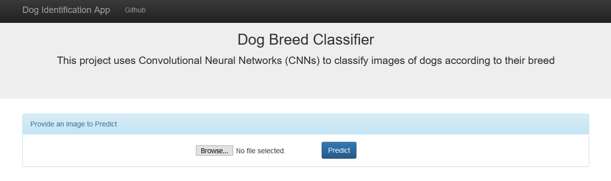
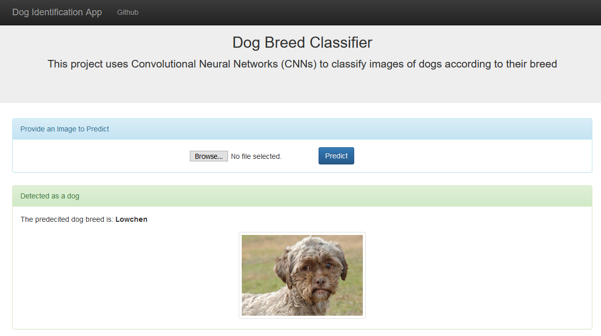
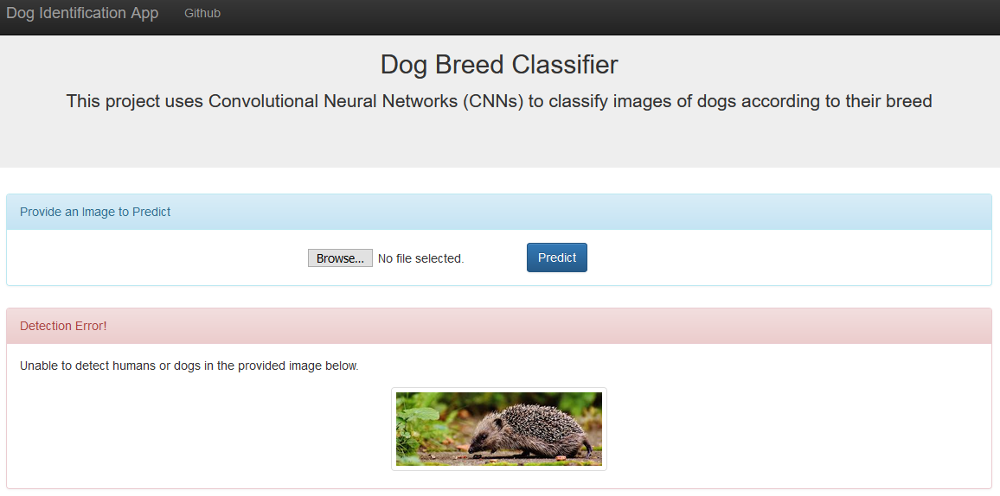
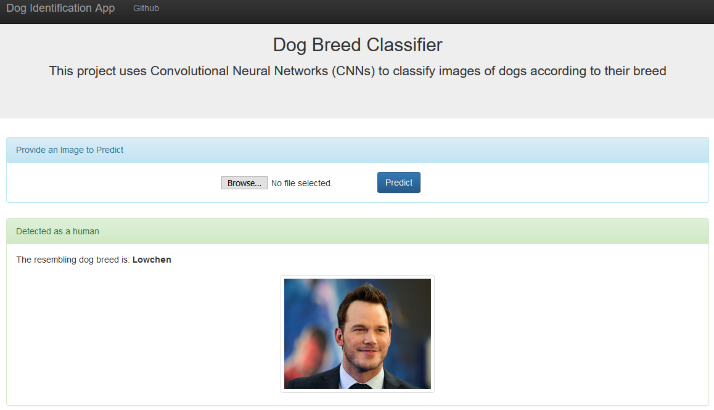
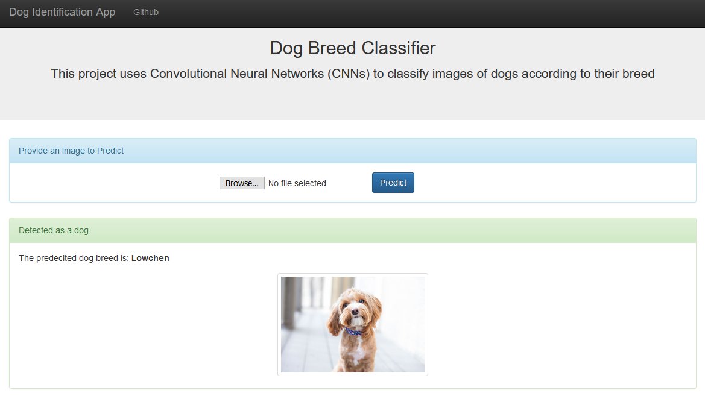

# Data Scientist Nanodegree

## Dog Breed Identification App
### Dog Breed Classifier
   
## Table of Contents

- [Project Overview](#overview)
- [Project Definition](#definition)
- [Project Process](#notebook)
- [Web App](#run)
- [Conclusion](#conclusion)
- [Files](#files)
- [Software Requirements](#sw)
- [Credits and Acknowledgements](#credits)

***

<a id='overview'></a>

## 1. Project Overview

Welcome to the Convolutional Neural Networks (CNN) project in the Data Scientist Nanodegree! In this project, you will learn how to build a pipeline that can be used within a web or mobile app to process real-world, user-supplied images. 

The classification algorithm accepts a file path to an image and first determines whether the image contains a human, dog, or neither. Then,

   - If a dog is detected in the image, return the predicted breed.
   - If a human is detected in the image, return the resembling dog breed.
   - If neither is detected in the image, provide output that indicates an error.

**_Screenshot 1_**



<a id='definition'></a>

### 2. Project Definition

There are many strategies for image classification solutions, and one of the most popular strategy is the use of Convolutional Neural Network (CNN). These are specialized type of neural network model designed for working with two-dimensional image data sets and can also be used for one-dimensional or three-dimensional data sets. In software modelling, CNNs take the form of having a “convolutional” layer. At a foundational level, a convolution is a linear operation that involves the multiplication of weights with the input, very similar to traditional neural networks such as the perceptron.

Due to their flexibility, I have chosen to implement a dog breed classifier using CNN based on the Keras library. While the solution could be achieved using other libraries such as Pytorch or Caffe, for this particular project Keras was chosen due to it’s ease of use and syntactic simplicity, facilitating fast development.

We are going to create a simple CNN classifier using Keras and measure it’s performance against using a random selection of dog breeds. The objective here is to create a classifier that beats the performance of using a naïve approach, being the selection of dog breed in a random fashion. The classifier will be designed bearing in mind the training times, and hence we will avoid having a classifier with more than 5 convolutional layers, and we will be judicious with the use of normalisation techniques as they can easily double or triple training times.

Next designing the classifier will be the use of transfer learning through testing popular networks such as VGG16, VGG19 and Xception. By tracking their performance during training and testing, the best performing classifier will be selected and used as the prediction CNN in our dog breed classier algorithm.

While there are many metrics that one could use to better judge the performance of a CNN, for this project an “accuracy” metric will be used with the object being to create a classifier that achieves over 60% classification accuracy. Accuracy, as a performance metric has been due to it’s simplicity and it is also the metric chosen by Udacity for the initial implementation.

By the end of the project, we anticipate having built a dog breed classification algorithm that makes use of transfer learning to increase accuracy and has the capabilities of predicting the breed of a given dog image with over 60% accuracy. The algorithm will be powerful enough to detect human faces in images and predict what dog breed the face resembles.

<a id='notebook'></a>

### 3. Project Process

You will need to download the following:

1. Download the [dog dataset](https://s3-us-west-1.amazonaws.com/udacity-aind/dog-project/dogImages.zip).  Unzip the folder and place it in the data folder 
2. Download the [human dataset](https://s3-us-west-1.amazonaws.com/udacity-aind/dog-project/lfw.zip).  Unzip the folder and place it in the the data folder
3. Download the [Xception bottleneck features](https://s3-us-west-1.amazonaws.com/udacity-aind/dog-project/DogXceptionData.npz) for the dog dataset.  Place it in the bottleneck_features folder.

Then, we will do the following:
- Import Datasets
- Detect Humans
- Detect Dogs
- Create a CNN to Classify Dog Breeds (from Scratch)
- Use a CNN to Classify Dog Breeds (using Transfer Learning)
- Create a CNN to Classify Dog Breeds (using Transfer Learning)
- Write our Algorithm
- Test our Algorithm

<a id='run'></a>

## 4. Web App

Now it's time to see the prediction in a user friendly way.

**Go the web directory** and run the following command:

```bat
python app.py
```

This will start the web app and will direct you to a URL where you can upload images and get classification results for it.

**_Screenshot 2_**



**_Screenshot 3_**



**_Screenshot 4_**



**_Screenshot 5_**



<a id='conclusion'></a>

## 5. Conclusion

As we will notice, the model need more enhancements on its accuracy. This will require improving the algorithm to give better results at a larger scale or in a production environment. The following should be considered:

##### 1. More variety of breeds is required to enhance the model prediction for humans
##### 2. Improve the model to be able to classify pictures with noise
##### 3. Increasing number of epoch might help as well
##### 4. More images as per classes of dog, will help to improve model's accuracy

<a id='files'></a>

## 6. Files

<pre>
.
├── bottleneck_features------------------------# TO STORE BOTTLENECK_FEATURES FILES
├── data---------------------------------------# TO STORE HUMAN AND DOG DATASETS
├── haarcascades
│   └── haarcascade_frontalface_alt.xml--------# USED FOR FACE DETECTION   
├── images-------------------------------------# PLOTS FOR USE IN README AND THE WEB APP
├── saved_models-------------------------------# LIST OF SAVED MODELS FROM APP
├── web
│   ├── model----------------------------------# WEB APP Model
│   ├── app.py---------------------------------# STARTUP WEB APP
│   ├── web.py---------------------------------# MAIN WEB APP
│   └── templates
│       ├── master.html------------------------# WEB APP HOME PAGE
│       └── predict.html-----------------------# WEB APP ACTION PAGE
├── dog_app.ipynb------------------------------# DOG BREED PYTHON APP
├── extract_bottleneck_features.py-------------# BOTTLENECK FEATURES SCRIPT
└── requirements.txt---------------------------# REQUIREMENTS FOR APP
</pre>

<a id='sw'></a>

## 7. Software Requirements

This project uses **Python 3.7** and the necessary libraries are mentioned in _requirements.txt_.

```bat
pip3 install -r requirements.txt
```

<a id='credits'></a>

## 8. Credits and Acknowledgements <a name='licensing'></a>

Must give credit to [Udacity](https://www.udacity.com/courses/all) for creating this beautiful learning experience.  
This project is licensed under the [MIT License](https://github.com/jeferson-sb/dogAI/blob/master/LICENSE).
