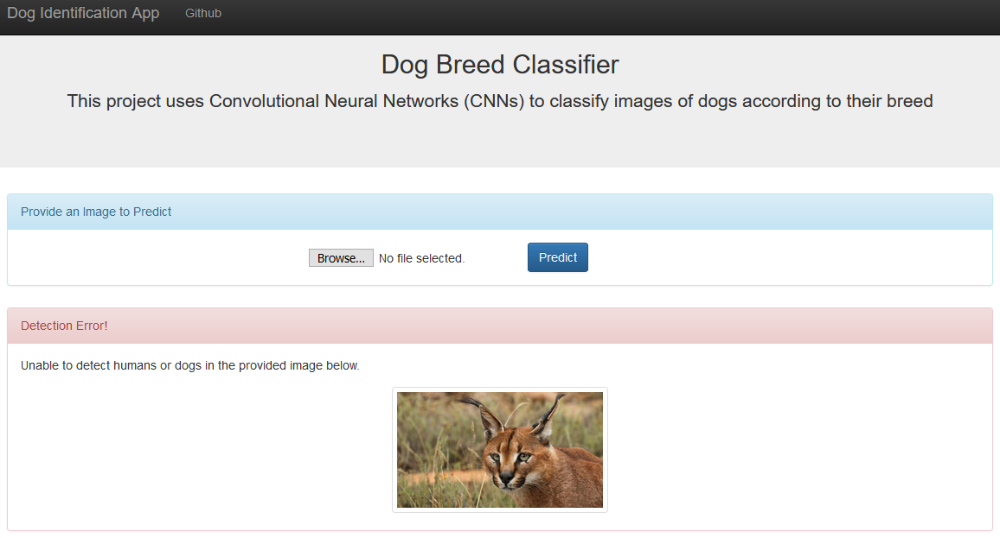

# Data Scientist Nanodegree

## Dog Breed Classifier
   
## Table of Contents

1. [Project Definition](#definition)
	* [Project Overview](#overview)	
	*  [Problem Statement](#statement)	
	*  [Metrics](#metrics)	
2. [Analysis](#analysis)
	* [Data Exploration](#exploration)
	* [Data Visualization](#visualization)
3. [Methodology](#methodology)
	* [Data Preprocessing](#preprocessing)
	* [Implementation](#implementation)
	* [Refinement](#refinement)
4. [Results](#results)
	* [Model Evaluation and Validation](#evaluation)
	* [Justification](#justification)
5. [Conclusion](#conclusion)
	* [Reflection](#reflection)
	* [Improvement](#improvement)
6. [Web Application](#app)
7. [Files](#files)
8. [Software Requirements](#sw)
9. [Credits and Acknowledgments](#credits)

***

<a id='definition'></a>

## 1. Project Definition

<a id='overview'></a>

### Project Overview 

This project aims to create a core algorithm to classify dog images according to their breed, that could be used as part of mobile or web app.

The application should provide a fun user experience as it will accept not only dog images but any user-supplied image as input.

If a dog is detected, the algorithm should output a prediction of the dog’s breed. If a human is detected, the output should be the most resembling dog breed.

If neither is detected, the algorithm should output an error!

<a id='statement'></a>

### Problem Statement 
	
The classifier used is Convolutional Neural Network (CNN), which is known as state-of-the-art of image classification. The following steps are involved:

	- Preprocess images

	- Build robust helper functions for human and dog detection

	- Experiment with building CNN classifiers from scratch

	- Train the classifier using transfer learning

	- Predict and analyze the results

The main library used to build CNN architecture throughout this project is Keras.

<a id='metrics'></a>

### Metrics 

While there are many metrics that one could use to better judge the performance of a CNN, for this project an “accuracy” metric will be used with the object being to create a classifier that achieves over 60% classification accuracy.

Accuracy, as a performance metric has been used because of its simplicity and it is the most relevant evaluation metric used for multi-class classification problems. 

The accuracy is defined as number of correct predictions over total number of predictions made.

Accuracy varies according to the network we use for transfer learning. We tested ResNet50, VGG19, Inception and Xception. ResNet50 and Xception prerformed the best (80% and 85% accuracy). Thus we chose to continue with Xception.

<a id='analysis'></a>

## 2. Analysis

<a id='exploration'></a>

### Data Exploration

The data for this project is provided by the following links:

    The human images dataset can be downloaded [here](https://s3-us-west-1.amazonaws.com/udacity-aind/dog-project/lfw.zip)
    The dog images dataset can be downloaded [here](https://s3-us-west-1.amazonaws.com/udacity-aind/dog-project/dogImages.zip)

The dog images dataset has a total of 8351 images. This is sorted into Training(6680 images), Test(836 images), Validate(835 images) directories.

Each of these directories have 133 sub-directories corresponding to 133 different breeds of the dogs. Different breeds have different amount of images.

Some breeds have upto 8 different images while some have only 4. So the data is imbalanced.

    There are 133 total dog categories.
    There are 8351 total dog images.

    There are 6680 training dog images.
    There are 835 validation dog images.
    There are 836 test dog images.

The following points were noted:

- Image size is not homogenous, thus image preprocessing will be compulsory.

- There can be more than one dog in an image, hence the learning task of classification model will be more complex.

- Image are provided with white background or with colored and diverse background, where various objects can be found.

For human images dataset there is a total of 13233 images stored under 5750 folders. All images are of the size (250 X 250). As in dog dataset, the data is imbalanced with some humans having only one image while some have multiple images.

    There are 13233 total human images.

<a id='visualization'></a>

### Data Visualization

The task of assigning breed to dogs from images is considered exceptionally challenging. To see why, consider that even a human would have great difficulty in distinguishing between a Brittany and a Welsh Springer Spaniel.

Brittany | Welsh Springer Spaniel

 | 

It was not difficult to find other dog breed pairs with only few inter-class variations (for instance, Curly-Coated Retrievers and American Water Spaniels).

Curly-Coated Retriever | American Water Spaniel

 | 

Likewise, labradors come in yellow, chocolate, and black. A vision-based algorithm will have to conquer this high intra-class variation to determine how to classify all of these different shades as the same breed.

Yellow Labrador | Chocolate Labrador | Black Labrador

 |  | 

<a id='methodology'></a>

## 3. Methodology

<a id='preprocessing'></a>

### Data Preprocessing

When using TensorFlow as backend, Keras CNNs require a 4D array as input, with shape (**nb_samples, rows, columns, channels**)

where nb_samples corresponds to the total number of images, and rows, columns, and channels correspond to the number of rows, columns, and channels for each image, respectively.

The **path_to_tensor** function below takes a string-valued file path to a color image as input and returns a 4D tensor suitable for supplying to a Keras CNN.

```python
from keras.preprocessing import image                  
from tqdm import tqdm

def path_to_tensor(img_path):
    # loads RGB image as PIL.Image.Image type
    img = image.load_img(img_path, target_size=(224, 224))
    # convert PIL.Image.Image type to 3D tensor with shape (224, 224, 3)
    x = image.img_to_array(img)
    # convert 3D tensor to 4D tensor with shape (1, 224, 224, 3) and return 4D tensor
    return np.expand_dims(x, axis=0)

def paths_to_tensor(img_paths):
    list_of_tensors = [path_to_tensor(img_path) for img_path in tqdm(img_paths)]
    return np.vstack(list_of_tensors)
```

First, it loads the image and resizes it to a square image. Next, the image is converted to an array, which is then resized to a 4D tensor.

In order to use the tensor in the pre-trained models in Keras, the RGB image has to be converted to BGR which is a re-ordering of the channels. 

Also, the mean pixel must be subtracted from every pixel in each image. 

This is implemented in the imported function **preprocess_input**. We rescale the images by dividing every pixel in every image by 255.

```python
from PIL import ImageFile                            
ImageFile.LOAD_TRUNCATED_IMAGES = True                 

# pre-process the data for Keras
train_tensors = paths_to_tensor(train_files).astype('float32')/255
valid_tensors = paths_to_tensor(valid_files).astype('float32')/255
test_tensors = paths_to_tensor(test_files).astype('float32')/255
```

<a id='implementation'></a>

### Implementation

The implementation process can be split into two main steps:

- Build CNN models from scratch

- Use transfer learning to have better performance

The first trial in building this model is building a CNN from scratch, without the use of transfer learning. 

Based on what we know about the purpose of transfer learning, it is likely that our results will be poor. A random chance is 1 out 133, so anything above 1% is better than random.

For basic CNN, I chose the following architecture:

_________________________________________________________________
Layer (type)                 Output Shape              Param #   
=================================================================
conv2d_31 (Conv2D)           (None, 224, 224, 16)      208       
_________________________________________________________________
max_pooling2d_10 (MaxPooling (None, 112, 112, 16)      0         
_________________________________________________________________
conv2d_32 (Conv2D)           (None, 112, 112, 32)      2080      
_________________________________________________________________
max_pooling2d_11 (MaxPooling (None, 56, 56, 32)        0         
_________________________________________________________________
conv2d_33 (Conv2D)           (None, 56, 56, 64)        8256      
_________________________________________________________________
max_pooling2d_12 (MaxPooling (None, 28, 28, 64)        0         
_________________________________________________________________
dropout_5 (Dropout)          (None, 28, 28, 64)        0         
_________________________________________________________________
flatten_6 (Flatten)          (None, 50176)             0         
_________________________________________________________________
dense_7 (Dense)              (None, 500)               25088500  
_________________________________________________________________
dropout_6 (Dropout)          (None, 500)               0         
_________________________________________________________________
dense_8 (Dense)              (None, 133)               66633     
=================================================================
Total params: 25,165,677
Trainable params: 25,165,677
Non-trainable params: 0
_________________________________________________________________

I used a model with three 2D convolutional layers. First, I choose 16 as the number of channels as this is a reasonable amount that will be increasing by a factor of 2 throughout layers.

Same padding is chosen over valid padding in order to preserve input value at the pixels near image edges.

Relu activation is chosen on 2D convolutional layers due to its reputation on performance in training CNN model.

I utilized max pooling to reduce the dimensionality. Pooling makes the CNN run faster but also reduces overfitting. Pooling is safe in this case since it’s likely that neighboring pixels are similar and downsampling, so you have fewer, will not reduce the classifier's ability to detect the image.

Dense layers are equipped with dropout to prevent overfitting. Final output layer is equipped with a softmax function.

When it came time to run the model, I selected 5 epochs because that is all it took to get to > 1% accuracy.

```python
# get index of predicted dog breed for each image in test set
dog_breed_predictions = [np.argmax(model.predict(np.expand_dims(tensor, axis=0))) for tensor in test_tensors]

# report test accuracy
test_accuracy = 100*np.sum(np.array(dog_breed_predictions)==np.argmax(test_targets, axis=1))/len(dog_breed_predictions)
print('Test accuracy: %.4f%%' % test_accuracy)

Test accuracy: 8.2536%
```

<a id='refinement'></a>

### Refinement

Building CNN from scratch was not great. Its accuracy was about 8.25%. This is better than random, but there’s a lot of room to improve. First, the VGG16 model was utilized. The best it could do was 41.14% accuracy.

So, I utilized different pre-trained models, and found that the best is Xception model that gave the best accuracy value equals to 85.29%. The details of the experiments performed and the final Network chosen are given below:

```python
network = 'Xception'

if network =='ResNet-50':
    bottleneck_features_network = np.load('bottleneck_features/DogResnet50Data.npz')
elif network == 'Inception':
    bottleneck_features_network = np.load('bottleneck_features/DogInceptionV3Data.npz')
elif network =='Xception':
    bottleneck_features_network = np.load('bottleneck_features/DogXceptionData.npz')
elif network =='VGG-19':
    bottleneck_features_network = np.load('bottleneck_features/DogVGG19Data.npz')
    
train_network = bottleneck_features_network['train']
valid_network = bottleneck_features_network['valid']
test_network = bottleneck_features_network['test']
```

|Model      | Train Acc (%)| Val Acc (%) | Test Acc (%) |
|-----------|--------------|-------------|--------------|
|VGG-19     |  62.02       | 49.82       | 51.44        |
|ResNet-50  |  99.82       | 82.75       | 80.74        |
|Inception  |  98.89       | 85.99       | 80.26        |
|Xception   |  98.38       | 85.39       | 85.29        |

As you can see from the results above, all networks except for the VGG-19 have a test accuracy of higher than 60% with the Xcpetion network performing the best at 85%.

More importantly though, there is a large difference between training and test accuracy for all the networks.The most important parameters in this case would be the different accuracy.

This can be attributed to either:

	- The size of the dataset is not large enough
	- The avoidable bias is very large because the network is not deep enough

The best architecture based on transfer learning from an Xception is what is used for the algorithm further below.

<a id='results'></a>

## 4. Results

<a id='evaluation'></a>

### Model Evaluation and Validation

Each model is trained during 20 epochs. A validation set is used to evaluate the model and checks whether validation loss decreases. If this is the case, the model weights are saved with a checkpointer and will be loaded later for testing.

The model built from scratch reported **8.2536%** of accuracy. From this benchmarking, we can conclude that more convolutional layers and more fully-connected layers help to improve model accuracy.

Transfer learning using VGG-16 network reported **41.14%** of accuracy on test set. This result is in concordance with the above analysis, since VGG-16 has upto 16 layers and was especially pre-trained on over 10 million images.

The final model which is a pre-trained Xception model achieved a good accuracy **85.29%**. It is then used to build the final algorithm.

To verify the robustness of this algorithm, several checks were performed with input images.

As of human images, the results is quite convincing, however, this is the fun part of the application and no accuracy metrics are applied.

<a id='justification'></a>

### Justification

The final model achieves a classification accuracy of **85.29%** on the test set, much higher than the benchmark. Transfer learning based on Xception is better than VGG-16.

|Model                 | Accuracy (%) |
|----------------------|--------------|
|CNN from Scratch      |  8.25        |
|Transfer from VGG-16  |  41.14       |
|Xception              |  85.29       |

**Why does the Xception Network do the best?**

The VGG-19 network consists of 19 traditional simple convolutional layers which are trained to learn image features. Hence, the result of training using this network results in a fairly good accuracy of around ~40%.

The ResNet, Inception and Xception architectures, however, use architectures (skip layers in the case of ResNet and Inception modules in the case of Inception and Xception) to enable training much deeper networks without over-fitting.

The Xception Network in particular uses an extreme Inception module architectures, which consists of 1x1 convolution filters, followed by multiple 3x3 or 5x5 filters, thus decoupling the mapping of cross-channels correlations and spatial correlations in the feature maps of convolutional neural networks [1]

*References*[1]: [*Xception: Deep Learning with Depthwise Separable Convolutions*](http://openaccess.thecvf.com/content_cvpr_2017/papers/Chollet_Xception_Deep_Learning_CVPR_2017_paper.pdf)

<a id='conclusion'></a>

## 5. Conclusion

<a id='reflection'></a>

### Reflection

To summarize, this project has been passing the following steps:

- Problem overview and statement

- Import dataset, explore data and pre-process input images

- Build helper functions for the final algorithm

- Build different CNN architectures and benchmark the classifiers

- Choose final model and integrate it to final algorithm

- Evaluate and verify the algorithm robustness

The most challenging and interesting part was building models from scratch. There is no better way to understand in deep CNNs than building and experiment with my own models.

Finally the results were much better than I expected.

<a id='improvement'></a>

### Improvement

To improve the model performance, several pathways are worth considering:

- More variety of breeds is required to enhance the model prediction for humans

- Improve the model to be able to classify pictures with noise

- Increasing number of epoch might help as well

- More images as per classes of dog, will help to improve model's accuracy

<a id='app'></a>

## 6. Web Application

Now it's time to see the prediction in a user friendly way.

**Go the web directory** and run the following command:

```bat
python app.py
```

This will start the web app and will direct you to a URL where you can upload images and get classification results for it.

**_Screenshot 2_**


**_Screenshot 2_**


**_Screenshot 3_**

 

**_Screenshot 4_**


**_Screenshot 5_**


**_Screenshot 6_**



<a id='files'></a>

## 7. Files

<pre>
.
├── bottleneck_features------------------------# TO STORE BOTTLENECK_FEATURES FILES
├── data---------------------------------------# TO STORE HUMAN AND DOG DATASETS
├── haarcascades
│   └── haarcascade_frontalface_alt.xml--------# USED FOR FACE DETECTION   
├── images-------------------------------------# PLOTS FOR USE IN README AND THE WEB APP
├── saved_models-------------------------------# LIST OF SAVED MODELS FROM APP
├── web
│   ├── model----------------------------------# WEB APP Model
│   ├── app.py---------------------------------# STARTUP WEB APP
│   ├── web.py---------------------------------# MAIN WEB APP
│   └── templates
│       ├── master.html------------------------# WEB APP HOME PAGE
│       └── predict.html-----------------------# WEB APP ACTION PAGE
├── dog_app.ipynb------------------------------# DOG BREED PYTHON APP
├── extract_bottleneck_features.py-------------# BOTTLENECK FEATURES SCRIPT
└── requirements.txt---------------------------# REQUIREMENTS FOR APP
</pre>

<a id='sw'></a>

## 8. Software Requirements

This project uses **Python 3.7** and the necessary libraries are mentioned in _requirements.txt_.

```bat
pip3 install -r requirements.txt
```

<a id='credits'></a>

## 9. Credits and Acknowledgements <a name='licensing'></a>

Must give credit to [Udacity](https://www.udacity.com/courses/all) for creating this beautiful learning experience.  
This project is licensed under the [MIT License](https://github.com/jeferson-sb/dogAI/blob/master/LICENSE).
