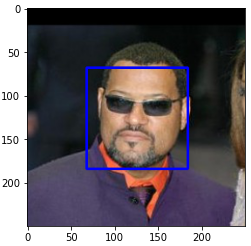

# Data Scientist Nanodegree

## Dog Breed Identification App
### Dog Breed Classifier
   
## Table of Contents

- [Project Overview](#overview)
- [Project Definition](#definition)
- [Project Process](#notebook)
- [Web App](#run)
- [Conclusion](#conclusion)
- [Files](#files)
- [Software Requirements](#sw)
- [Credits and Acknowledgements](#credits)

***

<a id='overview'></a>

## 1. Project Overview

Welcome to the Convolutional Neural Networks (CNN) project in the Data Scientist Nanodegree! In this project, you will learn how to build a pipeline that can be used within a web or mobile app to process real-world, user-supplied images. 

The classification algorithm accepts a file path to an image and first determines whether the image contains a human, dog, or neither. Then,

   - If a dog is detected in the image, return the predicted breed.
   - If a human is detected in the image, return the resembling dog breed.
   - If neither is detected in the image, provide output that indicates an error.

**_Screenshot 1_**


<a id='definition'></a>

### 2. Project Definition

There are many strategies for image classification solutions, and one of the most popular strategy is the use of Convolutional Neural Network (CNN). These are specialized type of neural network model designed for working with two-dimensional image data sets and can also be used for one-dimensional or three-dimensional data sets. In software modelling, CNNs take the form of having a “convolutional” layer. At a foundational level, a convolution is a linear operation that involves the multiplication of weights with the input, very similar to traditional neural networks such as the perceptron.

Due to their flexibility, I have chosen to implement a dog breed classifier using CNN based on the Keras library. While the solution could be achieved using other libraries such as Pytorch or Caffe, for this particular project Keras was chosen due to it’s ease of use and syntactic simplicity, facilitating fast development.

We are going to create a simple CNN classifier using Keras and measure it’s performance against using a random selection of dog breeds. The objective here is to create a classifier that beats the performance of using a naïve approach, being the selection of dog breed in a random fashion. The classifier will be designed bearing in mind the training times, and hence we will avoid having a classifier with more than 5 convolutional layers, and we will be judicious with the use of normalisation techniques as they can easily double or triple training times.

Next designing the classifier will be the use of transfer learning through testing popular networks such as VGG16, VGG19 and Xception. By tracking their performance during training and testing, the best performing classifier will be selected and used as the prediction CNN in our dog breed classier algorithm.

While there are many metrics that one could use to better judge the performance of a CNN, for this project an “accuracy” metric will be used with the object being to create a classifier that achieves over 60% classification accuracy. Accuracy, as a performance metric has been due to it’s simplicity and it is also the metric chosen by Udacity for the initial implementation.

By the end of the project, we anticipate having built a dog breed classification algorithm that makes use of transfer learning to increase accuracy and has the capabilities of predicting the breed of a given dog image with over 60% accuracy. The algorithm will be powerful enough to detect human faces in images and predict what dog breed the face resembles.

<a id='notebook'></a>

### 3. Project Process

You will need to download the following:

1. Download the [dog dataset](https://s3-us-west-1.amazonaws.com/udacity-aind/dog-project/dogImages.zip).  Unzip the folder and place it in the data folder 
2. Download the [human dataset](https://s3-us-west-1.amazonaws.com/udacity-aind/dog-project/lfw.zip).  Unzip the folder and place it in the the data folder
3. Download the [Xception bottleneck features](https://s3-us-west-1.amazonaws.com/udacity-aind/dog-project/DogXceptionData.npz) for the dog dataset.  Place it in the bottleneck_features folder.

Then we will use a systematic process workflow to make the project manageable, and this approach involved the following steps:

#### Import Dog Dataset:
In the code cell below, we import a dataset of dog images. We populate a few variables through the use of the load_files function from the scikit-learn library:

    train_files, valid_files, test_files - numpy arrays containing file paths to images
    train_targets, valid_targets, test_targets - numpy arrays containing onehot-encoded classification labels
    dog_names - list of string-valued dog breed names for translating labels

```python
from sklearn.datasets import load_files       
from keras.utils import np_utils
import numpy as np
from glob import glob
import PIL
from PIL import Image
from IPython.display import display, Image 

# define function to load train, test, and validation datasets
def load_dataset(path):
    data = load_files(path)
    dog_files = np.array(data['filenames'])
    dog_targets = np_utils.to_categorical(np.array(data['target']), 133)
    return dog_files, dog_targets

# load train, test, and validation datasets
train_files, train_targets = load_dataset('data/dogImages/train')
valid_files, valid_targets = load_dataset('data/dogImages/valid')
test_files, test_targets = load_dataset('data/dogImages/test')

# load list of dog names
dog_names = [item[20:-1] for item in sorted(glob("data/dogImages/train/*/"))]

# print statistics about the dataset
print('There are %d total dog categories.' % len(dog_names))
print('There are %s total dog images.\n' % len(np.hstack([train_files, valid_files, test_files])))
print('There are %d training dog images.' % len(train_files))
print('There are %d validation dog images.' % len(valid_files))
print('There are %d test dog images.'% len(test_files))
```

    Using TensorFlow backend.

    There are 133 total dog categories.
    There are 8351 total dog images.

    There are 6680 training dog images.
    There are 835 validation dog images.
    There are 836 test dog images.

#### Import Human Dataset:
In the code cell below, we import a dataset of human images, where the file paths are stored in the numpy array human_files.

```python
import random
random.seed(8675309)

# load filenames in shuffled human dataset
human_files = np.array(glob("data/lfw/*/*"))
random.shuffle(human_files)

# print statistics about the dataset
print('There are %d total human images.' % len(human_files))
```
    There are 13233 total human images.
    
#### Detect Humans:

OpenCV’s implementation of Haar feature-based cascade classifiers was used detect human faces in images, and this was done by first converting the image into grey-scale, and then passing the grey-scale image as a parameter to the detectMultiScale function. This function executes the classifier stored in face_detector custom function that makes use of the OpenCV CascadeClassifier.

```python
import cv2                
import matplotlib.pyplot as plt                        
%matplotlib inline                               

# extract pre-trained face detector
face_cascade = cv2.CascadeClassifier('haarcascades/haarcascade_frontalface_alt.xml')

# load color (BGR) image
img = cv2.imread(human_files[3])
# convert BGR image to grayscale
gray = cv2.cvtColor(img, cv2.COLOR_BGR2GRAY)

# find faces in image
faces = face_cascade.detectMultiScale(gray)

# print number of faces detected in the image
print('Number of faces detected:', len(faces))

# get bounding box for each detected face
for (x,y,w,h) in faces:
    # add bounding box to color image
    cv2.rectangle(img,(x,y),(x+w,y+h),(255,0,0),2)
    
# convert BGR image to RGB for plotting
cv_rgb = cv2.cvtColor(img, cv2.COLOR_BGR2RGB)

# display the image, along with bounding box
plt.imshow(cv_rgb)
plt.show()
```

    Number of faces detected: 1



Before using any of the face detectors, it is standard procedure to convert the images to grayscale. The detectMultiScale function executes the classifier stored in face_cascade and takes the grayscale image as a parameter.

In the above code, faces is a numpy array of detected faces, where each row corresponds to a detected face. Each detected face is a 1D array with four entries that specifies the bounding box of the detected face. The first two entries in the array (x and y) specify the horizontal and vertical positions of the top left corner of the bounding box. The last two entries in the array (w and h) specify the width and height of the box.

**Write a Human Face Detector**:
We can use this procedure to write a function that returns True if a human face is detected in an image and False otherwise. This function, aptly named face_detector, takes a string-valued file path to an image as input and appears in the code block below.

```python
# returns "True" if face is detected in image stored at img_path
def face_detector(img_path):
    img = cv2.imread(img_path)
    gray = cv2.cvtColor(img, cv2.COLOR_BGR2GRAY)
    faces = face_cascade.detectMultiScale(gray)
    return len(faces) > 0
```    

**Assess the Human Face Detector**:
- **Question 1**: 
Use the code cell below to test the performance of the face_detector function.
What percentage of the first 100 images in human_files have a detected human face? 
What percentage of the first 100 images in dog_files have a detected human face? 
Ideally, we would like 100% of human images with a detected face and 0% of dog images with a detected face. You will see that our algorithm falls short of this goal, but still gives acceptable performance. We extract the file paths for the first 100 images from each of the datasets and store them in the numpy arrays human_files_short and dog_files_short.

- **Answer**:
Percentage of human faces detection as human: 99%
Percentage of dog faces detection as human: 12%

```python
human_files_short = human_files[:100]
dog_files_short = train_files[:100]
# Do NOT modify the code above this line.

human_detects_counter = 0
dog_detects_counter = 0

for index in range(len(human_files_short)):   
    value = face_detector(human_files_short[index])
    if (value):
        human_detects_counter += 1
for index in range(len(dog_files_short)):    
    value = face_detector(dog_files_short[index])
    if (value):
        dog_detects_counter += 1
    
print('Percentage of human faces detection as human: {}%'.format(human_detects_counter))
print('Percentage of dog faces detection as human: {}%'.format(dog_detects_counter))
```    
      Percentage of human faces detection as human: 99%
      Percentage of dog faces detection as human: 12%

- **Question 2**: 
This algorithmic choice necessitates that we communicate to the user that we accept human images only when they provide a clear view of a face (otherwise, we risk having unneccessarily frustrated users!). In your opinion, is this a reasonable expectation to pose on the user? If not, can you think of a way to detect humans in images that does not necessitate an image with a clearly presented face?

- **Answer**:
I think users have their reasons to expect great results from this face detection algorithm. However, they need to understand that algorithms are not perfect and have their own flaws. Custom algorithms can be implemented to handle this scenario, but it will definitely take much time and effort to produce promising results. The beauty of using OpenCV library is you can get more 90% accuracy with less effort.

#### Detect Dogs:
A pre-trained ResNet-50 model was used to detect dogs in images. Given an image, this pre-trained ResNet-50 model returns a prediction (derived from the available categories in ImageNet) for the object that is contained in the image. Since our installed Keras module was using TensorFlow as a backend, the image had to be pre-processed because Keras CNNs require a 4D array as input, with shape (number of samples,rows,columns,channels).

```python
from keras.applications.resnet50 import ResNet50
from absl import logging
logging._warn_preinit_stderr = 0

# define ResNet50 model
ResNet50_model = ResNet50(weights='imagenet')
```

Finally, to detect dogs, we used the following function:

```python
### returns "True" if a dog is detected in the image stored at img_path
def dog_detector(img_path):
    prediction = ResNet50_predict_labels(img_path)
    return ((prediction <= 268) & (prediction >= 151))
```

The function above returns a value between 151 and 268 (inclusive) because the categories corresponding to dogs appear in an uninterrupted sequence and correspond to dictionary keys 151–268, inclusive.

**Assess the Dog Detector**:

**Question 3**: Use the code cell below to test the performance of your dog_detector function.

    What percentage of the images in human_files_short have a detected dog?
    What percentage of the images in dog_files_short have a detected dog?

**Answer**:

    Percentage of human faces detection as dogs: 1%.
    Percentage of dog faces detection as dogs: 100%


Having defined and tested functions for detecting humans and dogs in images, the next step is to create a CNN that classifies dog breeds. The goal is to create a CNN architecture that achieves at least 1% accuracy from scratch without the use of transfer learning.

#### Create a CNN to Classify Dog Breeds (from Scratch)

Now that we have functions for detecting humans and dogs in images, we need a way to predict breed from images.  In this step, you will create a CNN that classifies dog breeds.  You must create your CNN _from scratch_ (so, you can't use transfer learning _yet_!), and you must attain a test accuracy of at least 1%.  In Step 5 of this notebook, you will have the opportunity to use transfer learning to create a CNN that attains greatly improved accuracy.

Be careful with adding too many trainable layers!  More parameters means longer training, which means you are more likely to need a GPU to accelerate the training process.  Thankfully, Keras provides a handy estimate of the time that each epoch is likely to take; you can extrapolate this estimate to figure out how long it will take for your algorithm to train.

We mention that the task of assigning breed to dogs from images is considered exceptionally challenging.  To see why, consider that *even a human* would have great difficulty in distinguishing between a Brittany and a Welsh Springer Spaniel.  

Brittany | Welsh Springer Spaniel
- | -
 | 

It is not difficult to find other dog breed pairs with minimal inter-class variation (for instance, Curly-Coated Retrievers and American Water Spaniels).  

Curly-Coated Retriever | American Water Spaniel
- | -
 | 


Likewise, recall that labradors come in yellow, chocolate, and black.  Your vision-based algorithm will have to conquer this high intra-class variation to determine how to classify all of these different shades as the same breed.  

Yellow Labrador | Chocolate Labrador | Black Labrador
- | -
 |  | 

We also mention that random chance presents an exceptionally low bar: setting aside the fact that the classes are slightly imabalanced, a random guess will provide a correct answer roughly 1 in 133 times, which corresponds to an accuracy of less than 1%.  

Remember that the practice is far ahead of the theory in deep learning.  Experiment with many different architectures, and trust your intuition.  And, of course, have fun!

#### Pre-process the Data

We rescale the images by dividing every pixel in every image by 255.

```python
from PIL import ImageFile                            
ImageFile.LOAD_TRUNCATED_IMAGES = True                 

# pre-process the data for Keras
train_tensors = paths_to_tensor(train_files).astype('float32')/255
valid_tensors = paths_to_tensor(valid_files).astype('float32')/255
test_tensors = paths_to_tensor(test_files).astype('float32')/255
```

      100%|██████████| 6680/6680 [00:47<00:00, 141.80it/s]
      100%|██████████| 835/835 [00:05<00:00, 154.25it/s]
      100%|██████████| 836/836 [00:05<00:00, 156.05it/s]


#### Model Architecture

Create a CNN to classify dog breed.  At the end of your code cell block, summarize the layers of your model by executing the line:

        model.summary()

We have imported some Python modules to get you started, but feel free to import as many modules as you need.  If you end up getting stuck, here's a hint that specifies a model that trains relatively fast on CPU and attains >1% test accuracy in 5 epochs:


**Question 4**: Outline the steps you took to get to your final CNN architecture and your reasoning at each step. If you chose to use the hinted architecture above, describe why you think that CNN architecture should work well for the image classification task.

**Answer**: I have defined three filters layer with structure as 16, 32, 64 and with max-pooling layer to reduce the dimensionality from the data. I have used two dropouts and dense layers to optimize CNN and reduce the changes to overfitting. However, I think more work is needed to achieve the best performance. For this, argumented the dataset to add more training data.

```python
from keras.layers import Conv2D, MaxPooling2D, GlobalAveragePooling2D
from keras.layers import Dropout, Flatten, Dense
from keras.models import Sequential

# create the architecture using Sequential()
model = Sequential()

# convolution layer has 16 filters of size 2
model.add(Conv2D(filters=16, kernel_size=2, padding='same', activation='relu', input_shape=(224, 224, 3)))
# pooling layer with a 2 x 2 pixel filter 
model.add(MaxPooling2D(pool_size=2))

# convolution layer has 32 filters of size 2
model.add(Conv2D(filters=32, kernel_size=2, padding='same', activation='relu'))
# pooling layer with a 2 x 2 pixel filter 
model.add(MaxPooling2D(pool_size=2))

# convolution layer has 64 filters of size 2
model.add(Conv2D(filters=64, kernel_size=2, padding='same', activation='relu'))
# pooling layer with a 2 x 2 pixel filter 
model.add(MaxPooling2D(pool_size=2))

model.add(Dropout(0.5))
model.add(Flatten())
model.add(Dense(500, activation='relu'))
model.add(Dropout(0.5))
model.add(Dense(133, activation='softmax'))

model.summary()
```

```python
_________________________________________________________________
Layer (type)                 Output Shape              Param #   
=================================================================
conv2d_1 (Conv2D)            (None, 224, 224, 16)      208       
_________________________________________________________________
max_pooling2d_2 (MaxPooling2 (None, 112, 112, 16)      0         
_________________________________________________________________
conv2d_2 (Conv2D)            (None, 112, 112, 32)      2080      
_________________________________________________________________
max_pooling2d_3 (MaxPooling2 (None, 56, 56, 32)        0         
_________________________________________________________________
conv2d_3 (Conv2D)            (None, 56, 56, 64)        8256      
_________________________________________________________________
max_pooling2d_4 (MaxPooling2 (None, 28, 28, 64)        0         
_________________________________________________________________
dropout_1 (Dropout)          (None, 28, 28, 64)        0         
_________________________________________________________________
flatten_2 (Flatten)          (None, 50176)             0         
_________________________________________________________________
dense_1 (Dense)              (None, 500)               25088500  
_________________________________________________________________
dropout_2 (Dropout)          (None, 500)               0         
_________________________________________________________________
dense_2 (Dense)              (None, 133)               66633     
=================================================================
Total params: 25,165,677
Trainable params: 25,165,677
Non-trainable params: 0
_________________________________________________________________
```

**Test the Model**:
Now, we can use the CNN to test how well it identifies breed within our test dataset of dog images.  We print the test accuracy below.

```python
# get index of predicted dog breed for each image in test set
VGG16_predictions = [np.argmax(VGG16_model.predict(np.expand_dims(feature, axis=0))) for feature in test_VGG16]

# report test accuracy
test_accuracy = 100*np.sum(np.array(VGG16_predictions)==np.argmax(test_targets, axis=1))/len(VGG16_predictions)
print('Test accuracy: %.4f%%' % test_accuracy)
```

      Test accuracy: 41.7464%

- Use a CNN to Classify Dog Breeds (using Transfer Learning)
- Create a CNN to Classify Dog Breeds (using Transfer Learning)
- Write our Algorithm
- Test our Algorithm

<a id='run'></a>

## 4. Web App

Now it's time to see the prediction in a user friendly way.

**Go the web directory** and run the following command:

```bat
python app.py
```

This will start the web app and will direct you to a URL where you can upload images and get classification results for it.

**_Screenshot 2_**


**_Screenshot 3_**


**_Screenshot 4_**


**_Screenshot 5_**


<a id='conclusion'></a>

## 5. Conclusion

As we will notice, the model need more enhancements on its accuracy. This will require improving the algorithm to give better results at a larger scale or in a production environment. The following should be considered:

##### 1. More variety of breeds is required to enhance the model prediction for humans
##### 2. Improve the model to be able to classify pictures with noise
##### 3. Increasing number of epoch might help as well
##### 4. More images as per classes of dog, will help to improve model's accuracy

<a id='files'></a>

## 6. Files

<pre>
.
├── bottleneck_features------------------------# TO STORE BOTTLENECK_FEATURES FILES
├── data---------------------------------------# TO STORE HUMAN AND DOG DATASETS
├── haarcascades
│   └── haarcascade_frontalface_alt.xml--------# USED FOR FACE DETECTION   
├── images-------------------------------------# PLOTS FOR USE IN README AND THE WEB APP
├── saved_models-------------------------------# LIST OF SAVED MODELS FROM APP
├── web
│   ├── model----------------------------------# WEB APP Model
│   ├── app.py---------------------------------# STARTUP WEB APP
│   ├── web.py---------------------------------# MAIN WEB APP
│   └── templates
│       ├── master.html------------------------# WEB APP HOME PAGE
│       └── predict.html-----------------------# WEB APP ACTION PAGE
├── dog_app.ipynb------------------------------# DOG BREED PYTHON APP
├── extract_bottleneck_features.py-------------# BOTTLENECK FEATURES SCRIPT
└── requirements.txt---------------------------# REQUIREMENTS FOR APP
</pre>

<a id='sw'></a>

## 7. Software Requirements

This project uses **Python 3.7** and the necessary libraries are mentioned in _requirements.txt_.

```bat
pip3 install -r requirements.txt
```

<a id='credits'></a>

## 8. Credits and Acknowledgements <a name='licensing'></a>

Must give credit to [Udacity](https://www.udacity.com/courses/all) for creating this beautiful learning experience.  
This project is licensed under the [MIT License](https://github.com/jeferson-sb/dogAI/blob/master/LICENSE).
