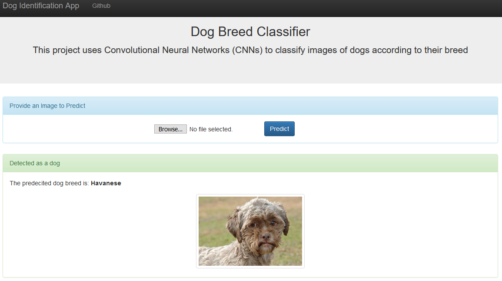
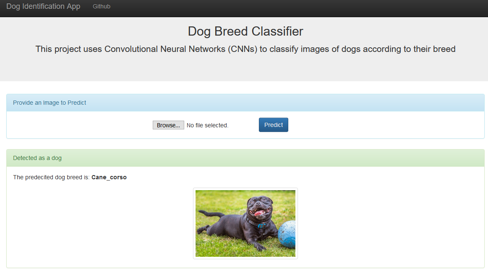

# Data Scientist Nanodegree

## Dog Breed Identification App
### Dog Breed Classifier
   
## Table of Contents

- [Project Overview](#overview)
- [Dog_app.ipynb](#notebook)
- [Web App](#run)
- [Conclusion](#conclusion)
- [Files](#files)
- [Software Requirements](#sw)
- [Credits and Acknowledgements](#credits)

***

<a id='overview'></a>

## 1. Project Overview

Welcome to the Convolutional Neural Networks (CNN) project in the Data Scientist Nanodegree! In this project, you will learn how to build a pipeline that can be used within a web or mobile app to process real-world, user-supplied images. Given an image of a dog, our algorithm will identify the dog breed. If supplied an image of a human, the code will identify the resembling dog breed.

**_Screenshot 1_**


<a id='notebook'></a>

### 2. Dog_app.ipynb Notebook

You will need to download the following:

1. Download the [dog dataset](https://s3-us-west-1.amazonaws.com/udacity-aind/dog-project/dogImages.zip).  Unzip the folder and place it in the data folder 
2. Download the [human dataset](https://s3-us-west-1.amazonaws.com/udacity-aind/dog-project/lfw.zip).  Unzip the folder and place it in the the data folder
3. Download the [Xception bottleneck features](https://s3-us-west-1.amazonaws.com/udacity-aind/dog-project/DogXceptionData.npz) for the dog dataset.  Place it in the bottleneck_features folder.

Then, we will do the following:
- Import Datasets
- Detect Humans
- Detect Dogs
- Create a CNN to Classify Dog Breeds (from Scratch)
- Use a CNN to Classify Dog Breeds (using Transfer Learning)
- Create a CNN to Classify Dog Breeds (using Transfer Learning)
- Write our Algorithm
- Test our Algorithm

<a id='run'></a>

## 3. Web App

Now it's time to see the prediction in a user friendly way.

**Go the web directory** and run the following command:

```bat
python app.py
```

This will start the web app and will direct you to a URL where you can upload images and get classification results for it.

**_Screenshot 2_**



**_Screenshot 3_**


**_Screenshot 4_**


**_Screenshot 5_**



<a id='conclusion'></a>

## 4. Conclusion

As we will notice, the model need more enhancements on its accuracy. This will require improving the algorithm to give better results at a larger scale or in a production environment. The following should be considered:

##### 1. More variety of breeds is required to enhance the model prediction for humans
##### 2. Improve the model to be able to classify pictures with noise
##### 3. Increasing number of epoch might help as well
##### 4. More images as per classes of dog, will help to improve model's accuracy

<a id='files'></a>

## 5. Files

<pre>
.
├── app
│   ├── run.py------------------------# FLASK FILE THAT RUNS APP│   
│   └── templates
│       ├── go.html-------------------# CLASSIFICATION RESULT PAGE OF WEB APP
│       └── master.html---------------# MAIN PAGE OF WEB APP
├── data
│   ├── DisasterResponse.db-----------# DATABASE TO SAVE CLEANED DATA TO
│   ├── disaster_categories.csv-------# DATA TO PROCESS
│   ├── disaster_messages.csv---------# DATA TO PROCESS
│   └── process_data.py---------------# PERFORMS ETL PROCESS
├── img-------------------------------# PLOTS FOR USE IN README AND THE WEB APP
├── models
│   └── train_classifier.py-----------# PERFORMS CLASSIFICATION TASK

</pre>

<a id='sw'></a>

## 6. Software Requirements

This project uses **Python 3.7** and the necessary libraries are mentioned in _requirements.txt_.

```bat
pip3 install -r requirements.txt
```

<a id='credits'></a>

## 7. Credits and Acknowledgements <a name='licensing'></a>

Must give credit to [Udacity](https://www.udacity.com/courses/all) for creating this beautiful learning experience.  
Also, credit to [pythonanywhere](https://www.pythonanywhere.com) for hosting my web app for free.

This project is licensed under the [MIT License](https://github.com/jeferson-sb/dogAI/blob/master/LICENSE).
